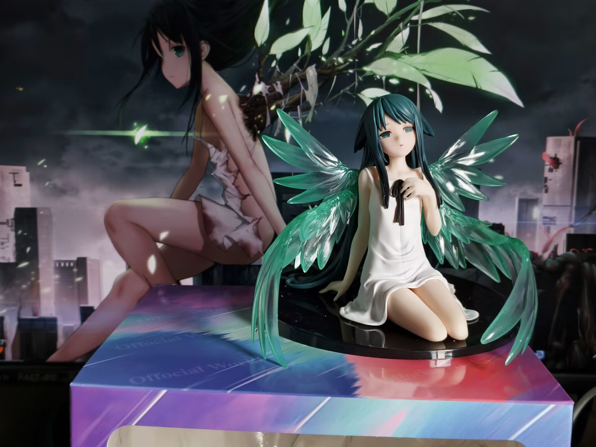
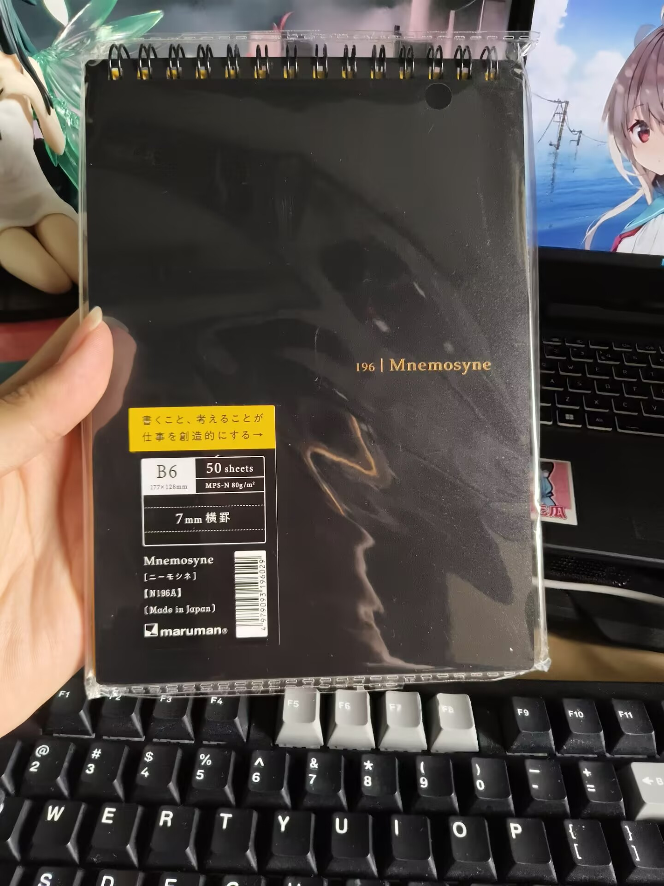
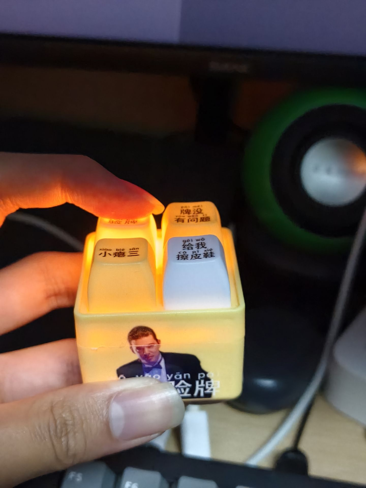
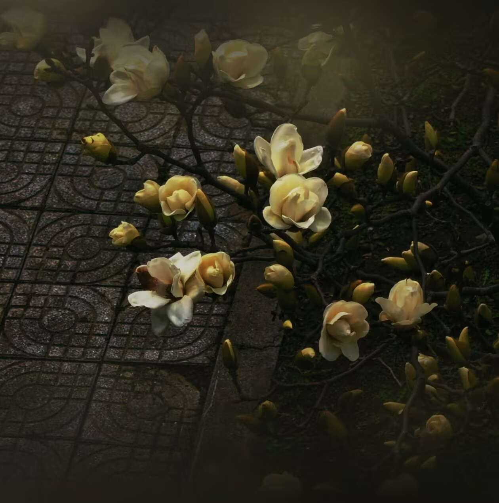

# 前言:
- 老实说，写这个赛博日记一方面是想要记录纪念，另一方面是担心写错字，在上面涂涂改改的，影响观感(我感觉我的字真心不好看)，但也希望尽己所能写的工整点吧。(os: 和女生交换日常这是第一次啊，真想留下点好印象QAQ)
# 2026
## 3月
### 6日
111，这是第一篇日记，该以什么方式开场呢？老实说，我没想好，也不知道该如何向你介绍我的日常。那天下午看见那条视频还挺意外的，总觉得那是种邀请，也挺惊喜的，在2.19号我们聊到了对网友的态度，你表示”现实并不会见面，大家都只相伴一小段路程“，我就觉得俩人无非只是种游戏搭子的关系（毕竟不会更深入理解双方）。但写日记，日常又有所不同，是一种从对方视角感受对方生活，字里行间衍生出的是一个人的三观，这何尝又不是一种精神上的交流呢，所以我是很期待和你交换日记的，同样也期待着你能抱有相同的想法，如果只是生活无聊想找找乐子对我来说也是无所谓吧（苦笑）
（本来写一堆了，发现都是些无聊的废话，这边就自动省略了）
日常，什么是日常...生活的闪光点！！！哦不，我该写什么...对了！我去年生日买的景品到了！  真好看呐~ ^v^, 你送我的笔记本也是，神秘又优雅的感觉qwQ 
今天学弟给我带了个玩具挺有意思的哈哈
还有就是，你拍的玉兰花也很美(太有水平了orz 
就这样吧，作为今天第一篇日记...